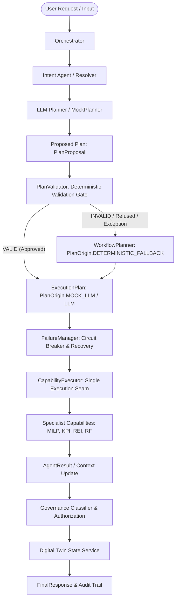

# NetGravity Agentic Architecture — Phase 8.5 (Offline Agentic Flow)

## 1. Overview & Objectives

Phase 8.5 establishes the complete **Agentic Orchestration Flow** within NetGravity. It realizes the full progression from natural language request, through LLM-proposed execution planning, deterministic validation, failure management, capability execution, specialist computation, and deterministic governance.

Because the system was built and validated in an offline environment (zero live LLM API calls permitted), the architecture introduces a dual-implementation strategy:
1. **MockPlanner**: A fully offline, deterministic mock planner providing 14 specialized scenarios (spanning happy-path intents, full network impact workflows, and adversarial edge cases) for local development and CI testing with 0 external API calls.
2. **LiveLLMPlanner**: A live planner implementing the exact same `LLMPlannerProtocol` interface, configured with a strict, non-bypassable rate limiter (`MAX_LIVE_PLANNER_CALLS = 15`) ready for live gateway validation.

---

## 2. End-to-End Control-Plane Pipeline

The authoritative NetGravity agentic workflow is strictly sequenced:



### Architectural Principles:
1. **The LLM Proposes WHAT TO RUN, not WHAT WAS FOUND**:
   The LLM proposes graph structure (nodes, dependencies, optionality, parameters). It is strictly forbidden from generating, altering, or returning domain calculations (e.g., `business_network_cost`, `pi`, `rei`, `rf`). The `PlanProposal` schema actively enforces this invariant.
2. **Deterministic Plan Validation as Authority**:
   Every plan proposal must pass deterministic DAG validation:
   - Unknown capabilities are rejected (`PlanFailureReason.UNKNOWN_CAPABILITY`).
   - Non-plannable capabilities (like `twin.publish` or `extraction.parse`) are rejected (`PlanFailureReason.NOT_PLANNABLE`).
   - Cyclic dependencies are rejected (`PlanFailureReason.DEPENDENCY_CYCLE`).
   - Missing hard dependencies are rejected (`PlanFailureReason.MISSING_HARD_DEPENDENCY`).
   - Duplicate step IDs or empty plans are rejected.
3. **Automatic Fallback to Authoritative Templates**:
   If an LLM proposal fails validation, times out, or throws an unretryable error, the Orchestrator falls back cleanly to `WorkflowPlanner` with `origin = PlanOrigin.DETERMINISTIC_FALLBACK` and emits structured audit warnings.
4. **Strict Signal Routing Separation**:
   - `MarketIntelligenceSignal` (e.g. diesel price hike, supplier news) routes through `ExternalSignalRouter` exclusively to the `ForecastingAgent`. It carries NO event probability and can NEVER reach `risk.compute_rf`.
   - `ExternalSignal` (e.g. flood, earthquake, physical strike) routes exclusively to `risk.compute_rf`.
   - Invariant: `event_probability ≠ confidence`.
   - Invariant: `failed RF ≠ RF = 0.0` (uncomputable risk is reported as `NOT_COMPUTABLE`).
5. **No Direct Agent-to-Agent Edges**:
   All communication flows through typed `AgentResult` objects and the `ExecutionContext`. No specialist capability directly invokes another capability.

---

## 3. Schema & Interface Contracts

### 3.1 `PlanProposal` & `ProposedPlanStep`
Defined in `netgravity.orchestrator.schemas.planner_contract`:
- `ProposedPlanStep`:
  - `step_id: str`
  - `capability: str`
  - `description: str`
  - `depends_on: List[str]`
  - `soft_depends_on: List[str]`
  - `params: Dict[str, Any]` (validated to ensure no domain calculation output keys are embedded)
  - `optional: bool`
- `PlanProposal`:
  - `workflow_id: str`
  - `intent: str`
  - `steps: List[ProposedPlanStep]`
  - `reasoning: str`
  - `planner_source: PlanOrigin`
  - `raw_model_output: Optional[str]`

### 3.2 `LLMPlannerProtocol`
```python
class LLMPlannerProtocol(Protocol):
    async def propose_plan(
        self,
        request: OrchestratorRequest,
        resolution: IntentResolution,
        context: Optional[ExecutionContext] = None,
    ) -> PlanProposal: ...
```

---

## 4. Supported Mock Scenarios (1–14)

| # | Scenario Name | Target Intent / Purpose | Expected Behavior |
|---|---|---|---|
| 1 | `NETWORK_STATE` | `NETWORK_STATE_QUERY` | Proposes load, solve, kpi, reason, govern. |
| 2 | `FORECAST` | `FORECAST` | Proposes forecast without solver. |
| 3 | `SCENARIO_ANALYSIS` | `SCENARIO_ANALYSIS` | Proposes scenario create, validate, solve, kpi, govern. |
| 4 | `MARKET_INTELLIGENCE`| `MARKET_INTELLIGENCE`| Proposes signal scoring and governance. |
| 5 | `RESILIENCE` | `RESILIENCE_QUERY` | Proposes REI assessment without hypothetical solve. |
| 6 | `FULL_NETWORK_IMPACT`| `SCENARIO_ANALYSIS` | Proposes multi-capability full network impact analysis. |
| 7 | `INVALID_CAPABILITY` | Error Simulation | Proposes `nonexistent.magic_solver` -> Rejected by validator -> Fallback. |
| 8 | `INVALID_DEPENDENCY` | Error Simulation | Proposes cyclic `step_a <-> step_b` -> Rejected by validator -> Fallback. |
| 9 | `FORBIDDEN_RF_PATH` | Security / Boundary | Proposes direct `risk.compute_rf` without prerequisites -> Rejected. |
| 10| `MALFORMED_PLAN` | Schema Validation | Empty step_id/capability -> Schema validation error. |
| 11| `EMPTY_PLAN` | Schema Validation | 0 steps proposed -> Rejected by validator (`EMPTY_PLAN`). |
| 12| `UNKNOWN_INTENT` | Intent Boundary | Intent UNKNOWN -> Minimal proposal. |
| 13| `LLM_UNAVAILABLE` | Gateway Simulation | Raises `LLMNonRetryableError` -> Immediate fallback. |
| 14| `RETRYABLE_PLANNER_FAILURE` | Gateway Simulation | Raises `LLMFailureError` (HTTP 429) -> Immediate fallback. |

---

## 5. Live Validation Safety & Quota Controls

The script `validation/agentic_phase_8_5_live.py` enables controlled live validation against the OpenAI Gateway:
- **Hard Call Counter**: `calls_attempted` is strictly incremented before each network call.
- **Quota Enforcer**: If `calls_attempted >= MAX_LIVE_PLANNER_CALLS (15)`, further calls immediately raise `LLMNonRetryableError`.
- **Zero API Key Leakage**: Reads tokens strictly from `TEXT_API_TOKEN` environment variable; never prints or logs tokens.
- **Safety Gate**: Guarded with `if __name__ == "__main__":` to ensure pytest discovery never invokes network endpoints.
